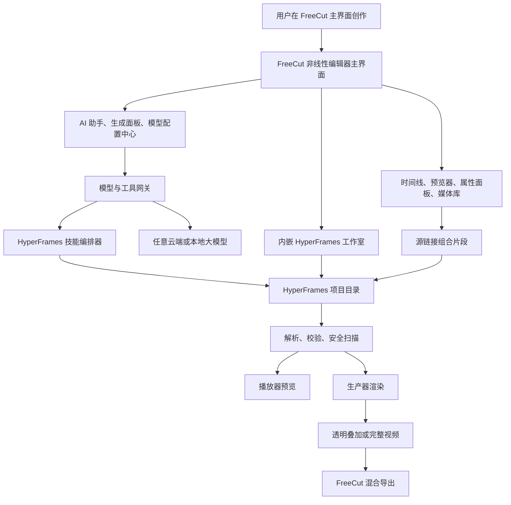

# 总览与阅读路线

## 文档目标

本目录是一套重新整理后的 FreeCut 与 HyperFrames 完整整合技术方案。它不沿用旧文档中“单个动画片段”“单一导出器”“把 HyperFrames 当成附属插件”的分散表述，而是把目标重新收敛为：

1. FreeCut 仍然是主界面、主项目、主时间线、主资产库和主导出入口。
2. HyperFrames 作为可嵌入的 HTML 视频生成、编辑、预览、校验、渲染和智能工作流能力源。
3. 用户可以在 FreeCut 主界面内用自然语言、模板、工作流、可视化工作室和时间线操作完成 AI 生成视频，再继续用非线性编辑器精修。
4. 用户可以自由配置任意大模型供应商、本地模型、私有网关、配额、密钥、代理、工具权限和运行环境。
5. 所有 HyperFrames 项目源码必须保留为可追溯、可校验、可回滚、可重新渲染的项目目录，而不是丢进时间线里的不可维护字符串。

## 依据资料

本方案综合了以下当前资料：

- `/Users/changzechuan/VideoAIEditProjects/freecut/docs/hyperframes-integration` 下全部既有方案、深研、报告、验证和发布文档。
- `/Users/changzechuan/VideoAIEditProjects/freecut/src/features/hyperframes-integration` 当前已落地源码。
- `/Users/changzechuan/VideoAIEditProjects/freecut/src/types/hyperframes.ts` 与 `/Users/changzechuan/VideoAIEditProjects/freecut/src/types/project.ts` 的当前数据模型。
- `/Users/changzechuan/VideoAIEditProjects/hyperframes` 的包级文档、命令行说明、播放器、工作室、解析器、校验器、生产器和技能体系说明。

## 新方案核心结论

最终形态不是“FreeCut 加一个 AI 按钮”，而是一个以 FreeCut 时间线为中心的双引擎创作系统：

- FreeCut 负责素材管理、原生剪辑、轨道编辑、字幕、特效、音频、项目保存、预览合成和最终出片管理。
- HyperFrames 负责基于 HTML 的动画组合、AI 生成视频片段、动态图形、网站转视频、产品视频、解释视频、字幕包装、音乐驱动视频、工作室编辑、帧精确渲染和透明叠加层输出。
- 整合层负责模型路由、技能编排、项目目录存储、主界面交互、预览同步、渲染调度、安全校验、成本控制和回滚。

## 章节结构

建议按顺序阅读，但每份文档都包含本章独立所需的背景和技术细节。

| 章节 | 文件 | 重点 |
| --- | --- | --- |
| 1 | `01-产品目标与用户体验.md` | 用户体验、主界面定位、创作流程、交互原则 |
| 2 | `02-总体架构与模块边界.md` | 系统分层、前端模块、服务模块、HyperFrames 包复用 |
| 3 | `03-数据模型与项目目录.md` | 项目清单、组合链接、资产、迁移、存储和版本治理 |
| 4 | `04-主界面集成设计.md` | 时间线、媒体库、预览器、属性面板、AI 面板和右键动作 |
| 5 | `05-模型配置与能力中心.md` | 任意大模型配置、本地模型、凭据、配额、权限和能力声明 |
| 6 | `06-生成工作流与技能编排.md` | 意图识别、技能选择、任务队列、导入预览、确认和回滚 |
| 7 | `07-工作室编辑与自然语言协作.md` | 内嵌工作室、源码编辑、属性编辑、自然语言修改和多人协作边界 |
| 8 | `08-预览渲染与导出管线.md` | 播放器、帧同步、透明叠加、生产器渲染、混合导出 |
| 9 | `09-安全隐私成本与运维.md` | 沙箱、校验、密钥、隐私、成本、日志、故障处理 |
| 10 | `10-实施路线图与验收标准.md` | 分期实施、测试策略、质量门禁、发布要求 |
| 11 | `11-资料映射与旧方案取舍.md` | 旧文档吸收关系、过时方案修正、当前代码映射 |
| 12 | `12-源码级迁移与包级集成细则.md` | HyperFrames 源码迁移目录、包级复用、重写边界、测试矩阵 |

## 统一术语

| 术语 | 本方案含义 |
| --- | --- |
| FreeCut 项目 | 用户正在编辑的主项目，包含时间线、素材、字幕、特效、音频和 HyperFrames 集成状态 |
| HyperFrames 项目目录 | 一个可独立运行的 HTML 视频项目目录，至少包含 `manifest.json`、入口文件、组合文件和资产引用 |
| HyperFrames 清单 | `HyperFramesProjectManifest`，记录项目标识、入口、当前组合、画布、帧率、时长、资产、来源和诊断 |
| 源链接组合片段 | FreeCut 时间线中的 `composition` 项，`sourceKind` 为 `hyperframes`，指向一个 HyperFrames 项目目录 |
| 可编辑近似项 | 从 HyperFrames HTML 反向导入出来的 FreeCut 文本、视频、音频、图片、形状或组合项，用于快速编辑但不取代源目录 |
| 技能任务 | 由 HyperFrames 技能或 FreeCut AI 编排生成的一次异步创作任务 |
| 模型配置 | 用户配置的大模型供应商、本地模型、私有网关、密钥、能力、成本和权限策略 |
| 源码镜像层 | FreeCut 仓库内保存 HyperFrames 相关源码的独立目录，保留来源路径、改写记录和本地适配层 |

## 架构总图



## 当前代码基线

当前 FreeCut 侧已经具备以下基线，可作为后续实现的起点：

- `src/types/hyperframes.ts` 已定义清单式项目目录、组合链接、渲染缓存和集成状态。
- `src/types/project.ts` 已允许 `Project.hyperframes` 和 `composition` 时间线项携带 HyperFrames 源链接字段。
- `src/features/hyperframes-integration/storage/composition-storage.ts` 已提供清单式项目目录存储适配。
- `src/features/hyperframes-integration/converters` 已提供 FreeCut 到 HyperFrames 项目目录、HyperFrames 项目目录到 FreeCut 的基础转换。
- `src/features/hyperframes-integration/studio` 已有轻量内嵌工作室面板样机。
- `src/features/hyperframes-integration/server/studio-adapter.ts` 已抽象文件读写、校验、块安装、缩略图、波形和渲染任务接口。
- `src/features/hyperframes-integration/ai` 已有意图识别、自然语言编辑、任务队列、推荐、确认和回滚的骨架。
- `src/features/hyperframes-integration/render/producer-render.ts` 已抽象生产器运行时检查、渲染任务和透明叠加计划。

## 本方案对旧文档的修正

旧文档中部分内容已经不再作为终态方案：

- 不再新增独立的 `hyperframes-composition` 时间线类型，改为复用 FreeCut 现有 `composition` 类型，并通过 `sourceKind: "hyperframes"` 区分来源。
- 不再把 HyperFrames 源码塞进时间线项的 `compositionHtml` 字段，改为保存完整项目目录。
- 不再把命令行技能当成唯一调用方式，改为“模型网关、技能编排、项目目录、导入预览、确认回滚”的产品化链路。
- 不再默认任意脚本可直接进入主预览，必须经过安全校验、沙箱预览和渲染门禁。
- 不再以“先生成最终视频再导入”为唯一流程，必须支持源目录继续编辑、部分反向映射、透明叠加、完整渲染和 FreeCut 原生混剪。

## 源码级集成总原则

本方案采用源码级集成优先原则。凡是能力来自 HyperFrames 自身包的，不把 FreeCut 写成依赖 `@hyperframes/*` npm 包的应用，而是在 FreeCut 仓库内建立独立源码镜像层，并在镜像层上做 FreeCut 适配。

建议目录：

```text
src/features/hyperframes-runtime/
  upstream/
    core/
    parsers/
    lint/
    player/
    studio/
    studio-server/
    producer-node/
    cli-tools/
    skills/
  adapters/
    freecut-project/
    freecut-storage/
    freecut-preview/
    freecut-render/
    freecut-models/
  bridges/
    player-bridge/
    studio-bridge/
    skills-bridge/
    render-bridge/
  provenance/
    upstream-manifest.json
    patch-notes.md
```

落地要求：

1. `upstream/*` 保存从 `/Users/changzechuan/VideoAIEditProjects/hyperframes` 迁移来的源码子集或完整包源码。
2. `adapters/*` 保存 FreeCut 专属适配代码，禁止把 FreeCut 状态写入上游镜像源码。
3. `bridges/*` 保存 UI、任务队列、播放器和渲染桥接逻辑。
4. `provenance/upstream-manifest.json` 记录每个迁移目录来自 HyperFrames 的包名、源码路径、提交或本地快照时间、迁移方式和本地修改说明。
5. 业务代码只从 `src/features/hyperframes-runtime` 或现有 `src/features/hyperframes-integration` 引入能力，不直接引用 `@hyperframes/core`、`@hyperframes/player`、`@hyperframes/studio`、`@hyperframes/studio-server`、`@hyperframes/producer`。
6. 如果迁移代码内部存在 `@hyperframes/*` import，迁移时统一改写为镜像层内部相对路径或 FreeCut 的本地 alias。
7. Node、Chrome、FFmpeg、Puppeteer、Hono 等服务端能力必须隔离到 `producer-node`、`studio-server` 或本地服务适配层，不能进入主浏览器 bundle。

因此，后续实现应把“集成 HyperFrames”理解为“把 HyperFrames 的源码能力迁移到 FreeCut 的可维护运行时层”，而不是在 FreeCut 中安装一组上游 npm 包再包一层 UI。
