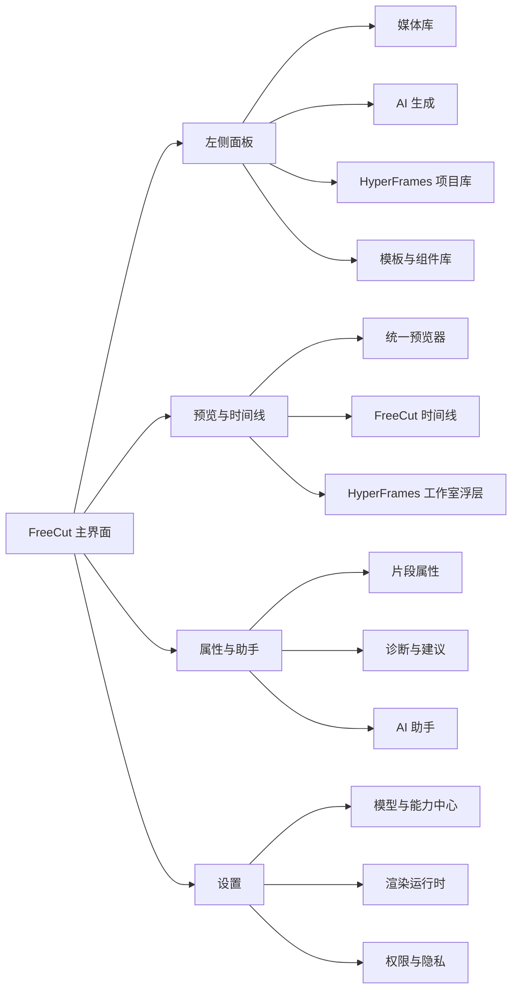

# 产品目标与用户体验

## 本章目标

本章定义整合后的产品形态、用户心智、主界面体验和关键流程。它回答一个核心问题：用户为什么会觉得 HyperFrames 已经自然融入 FreeCut，而不是另一个外置工具。

## 产品定位

整合后的产品应定位为“带 AI 生成能力的专业非线性编辑器”，而不是“带时间线的 AI 生成器”。因此所有体验设计必须遵守三条主线：

1. 用户始终留在 FreeCut 主界面完成创作。
2. HyperFrames 生成内容必须变成时间线上的可管理资产、可编辑组合、可渲染片段和可追溯项目。
3. AI 只是提高起稿、动画、包装、重剪、字幕、解释和设计效率的助手，不能绕过确认、版本、撤销和导出质量门禁。

## 目标用户

| 用户类型 | 主要诉求 | 整合后能力 |
| --- | --- | --- |
| 剪辑师 | 快速获得片头、字幕包装、转场、动态图形和宣传片初稿 | 在时间线上选中位置，直接生成并继续精剪 |
| 内容运营 | 用文字、链接、素材快速生成短视频、产品介绍和社交媒体版本 | 用生成面板选择模板、时长、比例和品牌风格 |
| 设计师 | 保留 HTML、动效、字体、变量和组件级编辑能力 | 在内嵌工作室中编辑源码、变量、时间线和预览 |
| 开发者 | 自动把网站、产品、文档、代码变更生成视频 | 通过技能工作流和项目目录批量生成 |
| 团队管理员 | 控制模型、密钥、费用、安全和发布质量 | 在模型配置中心统一管理供应商、额度和权限 |

## 主界面体验原则

### 一、默认不打断剪辑心流

AI 入口必须服务于当前时间线，而不是夺走主界面。默认情况下：

- 左侧媒体库增加“AI 生成”和“HyperFrames 项目”页签。
- 时间线中的 HyperFrames 片段表现为普通组合片段，可移动、修剪、复制、分组、禁用和导出。
- 右侧属性面板显示该片段的基础参数、源项目、变量、渲染缓存、诊断和快捷动作。
- 双击或回车打开内嵌工作室，关闭后回到原时间线位置。

### 二、所有 AI 行为先预览再应用

任何会改变项目的行为都必须有四步：

1. 生成动作计划。
2. 展示差异预览。
3. 用户确认。
4. 写入项目并记录回滚点。

这条规则覆盖自然语言改时间线、改 HyperFrames 文件、运行技能、导入生成结果、替换渲染缓存和批量操作。

### 三、源目录永远可找回

用户看到的是时间线片段，但系统必须保留：

- 生成时的提示词和模型配置。
- 技能任务编号和日志。
- HyperFrames 项目目录清单。
- 输入素材和输出资产哈希。
- 导入时的诊断和不支持特性。
- 最近一次确认导入和渲染的回滚记录。

### 四、模型配置必须产品化

用户不能被迫只使用某个固定模型。主界面需要提供“模型与能力中心”，支持：

- 云端大模型供应商。
- 私有模型网关。
- 本地模型。
- FreeCut 已有的本地语音、字幕、场景、嵌入和生成能力。
- HyperFrames 技能所需的文本、视觉、语音、转写、素材检索、网页抓取、渲染和存储能力。

### 五、结果既能直接用，也能继续拆

每个生成结果至少提供三种使用方式：

- 作为源链接 HyperFrames 组合片段放入时间线。
- 渲染为透明叠加或普通视频，作为媒体素材放入时间线。
- 尽可能反向解析为 FreeCut 原生文本、媒体、图片、音频、形状和关键帧，方便精修。

## 核心用户旅程

### 旅程一：从一句话生成片头

1. 用户在时间线第 0 帧点击“生成片头”。
2. 输入：“做一个 6 秒科技感产品发布片头，使用当前项目品牌色，最后落到标题。”
3. 系统识别为动态图形任务，推荐对应技能和所需模型。
4. 用户选择模型、比例、时长、是否透明背景、是否包含音效。
5. 系统生成任务，展示步骤、日志和中间预览。
6. 生成完成后展示三个按钮：导入时间线、打开工作室、重新生成。
7. 用户确认导入，时间线上出现一个 HyperFrames 源链接组合片段。
8. 用户双击片段进入工作室微调标题、颜色和动效。
9. 用户关闭工作室后继续在 FreeCut 中剪辑。

### 旅程二：把网站变成宣传短片

1. 用户在 AI 生成面板选择“网站转视频”。
2. 输入网址、目标时长、画幅、语言、配音、字幕和品牌风格。
3. 系统调用网页抓取、素材解析、脚本生成、画面规划和 HyperFrames 项目生成。
4. 系统自动运行校验，列出媒体缺失、文字溢出、脚本风险、渲染预计成本。
5. 用户在预览中修改场景顺序和文案变量。
6. 系统导入为一个主 HyperFrames 组合片段，同时把旁白、音乐和字幕作为可选 FreeCut 原生轨道暴露。
7. 用户继续用 FreeCut 做封面、结尾、配乐和版本裁切。

### 旅程三：用自然语言精修时间线

1. 用户选中几个片段，对助手说：“把这三个镜头节奏变快，加一个干净的片尾标题。”
2. 助手生成动作计划：缩短片段、添加转场、运行标题生成技能、插入组合片段。
3. 右侧展示差异列表和风险说明。
4. 用户确认后，系统应用时间线修改并创建回滚点。
5. 用户不满意时点击回滚，所有改动恢复。

### 旅程四：使用任意私有模型

1. 管理员打开模型配置中心。
2. 添加一个自定义供应商，填写基础地址、鉴权方式、模型列表、上下文长度、计费单位和支持能力。
3. 为团队创建“默认视频生成模型”“默认视觉理解模型”“默认转写模型”“低成本草稿模型”等能力映射。
4. 用户生成视频时只选择能力或质量档位，不需要理解底层模型细节。
5. 任务日志记录实际使用的模型、输入输出令牌、耗时和费用估算。

## 主界面信息架构



## 体验状态

所有生成和编辑流程必须具备以下状态表达：

| 状态 | 用户看到什么 | 可执行动作 |
| --- | --- | --- |
| 未配置 | 缺少模型或渲染运行时提示 | 打开配置中心、选择本地草稿模式 |
| 可生成 | 输入框、模板、推荐技能 | 生成预览、直接加入队列 |
| 排队中 | 队列位置、预计时间、费用估算 | 取消、后台运行 |
| 运行中 | 任务步骤、日志、部分预览 | 暂停、取消、查看详情 |
| 需确认 | 差异、风险、诊断、预览 | 确认导入、修改参数、丢弃 |
| 已导入 | 时间线片段、源目录链接、回滚点 | 打开工作室、渲染、转为原生组合 |
| 有诊断 | 警告标记、缺失资产、脚本风险 | 修复、忽略、重新生成 |
| 渲染中 | 渲染进度、当前阶段、剩余时间 | 取消、后台运行 |
| 可发布 | 质量门禁通过 | 导出、打包、发布 |

## 成功体验标准

1. 用户第一次生成片头不需要离开 FreeCut。
2. 用户能从时间线清楚区分普通组合和 HyperFrames 源链接组合。
3. 用户能在同一预览器里查看 FreeCut 原生片段和 HyperFrames 片段的合成效果。
4. 用户能随时打开源项目继续编辑，并回到时间线。
5. 用户能清楚知道 AI 将改变什么，且能撤销。
6. 用户能选择任意模型供应商或本地模型，并知道费用和能力差异。
7. 用户能把生成结果导出为最终视频，也能导出为可移植的 HyperFrames 项目目录。

## 开发落地补充：体验到工程对象的映射

为了让体验要求直接转成开发任务，主界面需要建立以下工程对象：

| 体验对象 | FreeCut 落点 | HyperFrames 源码来源 | 适配说明 |
| --- | --- | --- | --- |
| 生成入口 | 左侧 AI 面板、素材库生成按钮、时间线右键菜单 | `skills/*`、`packages/cli/src/commands/skills.ts` 的能力注册思想 | 不迁移 CLI 命令界面，只迁移技能元数据、任务编排和输出规范 |
| 片段预览 | 中央统一预览器 | `packages/player/src/hyperframes-player.ts`、`packages/studio/src/player/hooks/useTimelinePlayer.ts` | 迁移为 FreeCut 的 `HyperFramesPlayerBridge`，与 FreeCut 播放时钟同步 |
| 工作室浮层 | 中央浮层或右侧扩展编辑面板 | `packages/studio/src/App.tsx`、`components/nle/*`、`components/editor/*` | 第一阶段嵌入子集，后续迁移完整 Studio 布局 |
| 文件编辑 | 工作室文件树、源码编辑器、保存队列 | `packages/studio/src/components/editor/SourceEditor.tsx`、`FileTree.tsx`、`utils/sourcePatcher.ts` | 文件写入必须走 FreeCut 项目目录适配器，不直接写磁盘 |
| 属性编辑 | 右侧属性面板和工作室属性面板 | `packages/studio/src/components/editor/PropertyPanel.tsx` 及属性子模块 | FreeCut 选中时间线项时显示片段级属性，进入工作室后显示 DOM 级属性 |
| 元素选择 | 预览区点击选择、框选、图层面板 | `useElementPicker`、`DomEditOverlay.tsx`、`LayersPanel.tsx` | 选择结果转为 FreeCut 可理解的 `HyperFramesSelectionSnapshot` |
| 生成确认 | 生成结果预览抽屉 | `studio-server` 的 lint、preview、thumbnail 思路 | 不直接导入，先展示项目目录、诊断、预计成本和导入策略 |
| 回滚 | FreeCut undo 栈和 HyperFrames 文件快照 | `backupJournal.ts`、`sourceMutation.ts` | 每次 AI 写入和 Studio 保存都生成可回退补丁记录 |

用户旅程也应拆成状态机，而不是散落在按钮回调中：

```text
空闲
  -> 输入需求
  -> 选择模型和技能
  -> 生成计划
  -> 用户确认计划
  -> 运行任务
  -> 产出项目目录
  -> 校验与预览
  -> 用户选择导入策略
  -> 写入 FreeCut 项目
  -> 可编辑、可渲染、可回滚
```

每个状态都要有明确数据对象：

- `GenerationDraft`：用户意图、选中素材、目标时间线位置、模型配置、技能候选。
- `GenerationPlan`：步骤、工具权限、模型调用预算、输出目录、预期时长和格式。
- `GenerationJob`：队列任务、运行环境、日志、取消信号、重试次数。
- `GeneratedProjectCandidate`：HyperFrames 项目目录、manifest、诊断、缩略图、预览 URL。
- `ImportDecision`：源链接组合、渲染媒体、近似原生项或组合拆解。

交互细节要求：

1. 任何模型调用前都要显示模型名、能力、预计费用、会读取的素材范围和会写入的项目目录。
2. 任何写入 FreeCut 时间线或 HyperFrames 源文件的动作都要先形成可预览 diff。
3. 双击 HyperFrames 片段打开工作室时，FreeCut 要记住原时间线位置、缩放、选中轨道和播放头，关闭工作室后恢复。
4. 工作室内播放和主预览播放必须共享当前帧概念；允许不同 UI 呈现，但不能出现相差多帧的状态。
5. 生成结果失败时保留任务日志和临时项目目录，允许用户把失败状态交给模型修复。
6. 用户选择“转为原生项”时要明确提示这是近似转换，源目录仍然保留。
