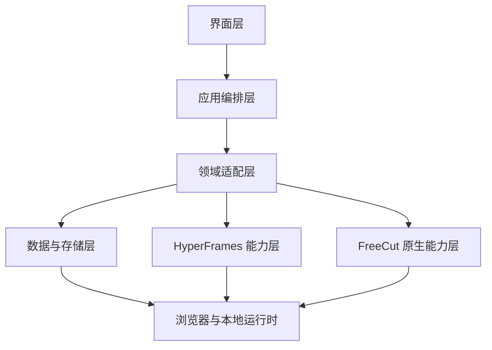
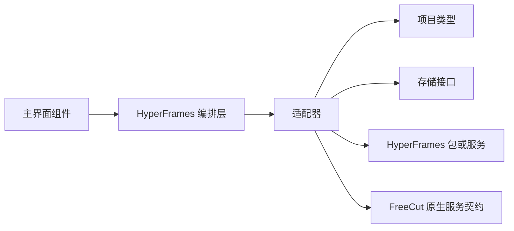

# 总体架构与模块边界

## 本章目标

本章定义整合系统的技术分层、模块边界、包复用策略和数据流。它面向实现团队，说明哪些能力留在 FreeCut，哪些能力复用 HyperFrames，哪些能力必须由整合层新增。

## 总体原则

1. FreeCut 不被改造成 HyperFrames 项目编辑器，FreeCut 项目仍是主项目。
2. HyperFrames 不被拆散重写，优先复用其公开包、命令行、工作室、播放器、解析器、校验器和生产器。
3. 整合层只负责适配和编排，不直接污染 FreeCut 原有媒体、时间线和导出核心。
4. 所有跨边界调用必须通过类型化接口、任务状态、诊断结果和可回滚写入完成。

## 系统分层



### 界面层

界面层位于 FreeCut 主界面内，包含：

- AI 生成面板。
- AI 助手对话面板。
- HyperFrames 项目库。
- 时间线源链接组合片段。
- 内嵌工作室浮层。
- 右侧属性、变量、诊断和渲染面板。
- 模型与能力配置中心。

界面层不直接写项目文件，也不直接调用大模型。它只能发起意图、展示预览、收集确认并订阅任务状态。

### 应用编排层

应用编排层负责把用户意图转成可执行计划：

- 意图识别。
- 工作流选择。
- 模型能力路由。
- 技能任务编排。
- 导入预览。
- 差异确认。
- 回滚记录。
- 通知和日志。

当前可从 `src/features/hyperframes-integration/ai` 扩展：

- `assistant-core.ts` 负责意图、上下文、大模型调用和动作预览。
- `natural-language-editing.ts` 负责自然语言时间线操作、工作室文件修改和推荐。
- `skills-jobs.ts` 负责技能任务、导入预览和安全导入。

### 领域适配层

领域适配层隔离 FreeCut 与 HyperFrames 的模型差异：

- FreeCut 时间线与 HyperFrames 项目目录互转。
- HyperFrames 工作室接口适配 FreeCut 的项目目录存储。
- HyperFrames 生产器渲染任务适配 FreeCut 导出任务。
- FreeCut 原生 AI 能力与 HyperFrames 技能能力统一注册。
- FreeCut 预览时钟与 HyperFrames 播放器时钟同步。

当前可从以下模块扩展：

- `converters`：项目目录导入导出。
- `timeline`：源链接组合动作和信息解析。
- `server/studio-adapter.ts`：工作室读写、缩略图、波形、块安装和渲染接口。
- `render/producer-render.ts`：生产器运行时检查、任务状态和透明叠加。

### 数据与存储层

数据与存储层负责：

- FreeCut 项目 JSON。
- HyperFrames 项目目录。
- 清单索引。
- 资产引用。
- 渲染缓存。
- AI 任务历史。
- 模型配置。
- 凭据引用。
- 诊断与回滚记录。

当前 `HyperFramesProjectStorage` 已提供浏览器文件系统适配器，后续需要加入二进制资产复制、缓存清理、项目打包和导入导出能力。

### HyperFrames 能力层

优先复用以下包和能力：

| 能力 | 源码来源 | 用途 |
| --- | --- | --- |
| 项目约束 | `packages/core/src`、文档中的组合规范 | 组合元数据、变量、运行时约束 |
| HTML 与动效解析 | `packages/parsers/src` | 解析 HTML、编辑元素、解析与回写动效 |
| 结构校验 | `packages/lint/src` | 导入、预览、渲染前门禁 |
| 播放器 | `packages/player/src` | 主预览或工作室预览的隔离播放 |
| 工作室 | `packages/studio/src` | 可视化编辑、时间线视图、源码编辑、元素选择 |
| 工作室服务 | `packages/studio-server/src` | 文件监听、热更新、项目服务接口参考 |
| 生产渲染 | `packages/producer/src` | 帧精确渲染、透明背景、音频混合、进度、取消 |
| 命令行 | `hyperframes` | 初始化、预览、校验、渲染、诊断、技能安装 |
| 技能体系 | HyperFrames 21 个技能 | 产品视频、网站视频、动态图形、字幕、重剪、讲解等生成 |

### FreeCut 原生能力层

保留并复用 FreeCut 的能力：

- 媒体库、代理、波形、胶片条、素材引用。
- 多轨时间线、组合片段、关键帧、转场、字幕、文本动效和音频处理。
- 浏览器本地存储、项目迁移、导入导出、打包。
- WebCodecs、WebGPU、画布预览、导出队列。
- 已有本地 AI：转写、字幕、场景检测、嵌入、语音合成、音乐生成。

## 模块边界

### 禁止的直接依赖

- FreeCut 通用基础设施不能直接依赖 `features/hyperframes-integration`。
- HyperFrames 集成模块不能绕过 FreeCut 项目保存 API 直接改全局状态。
- 大模型响应不能直接写入项目。
- 工作室 iframe 不能直接获得主窗口完整权限。
- 技能任务输出不能绕过校验直接进入时间线。

### 允许的依赖方向



## 核心运行链路

### 生成链路

1. 用户输入目标、素材、位置、风格和模型偏好。
2. 意图路由器选择技能或工作流。
3. 模型网关选择供应商、模型、工具权限和预算。
4. 技能编排器创建任务目录并调用模型。
5. 输出 HyperFrames 项目目录。
6. 解析器和校验器检查结构、安全和素材。
7. 导入器生成源链接组合片段和可选可编辑近似项。
8. 用户确认后写入 FreeCut 项目。

### 编辑链路

1. 用户双击时间线上的 HyperFrames 组合片段。
2. 系统根据 `compositionLinks` 找到项目目录。
3. 工作室适配器提供文件树、当前组合、变量、缩略图、波形、诊断。
4. 用户在源码、属性、时间线或自然语言面板中修改。
5. 每次保存更新项目目录、清单签名和 FreeCut 项目状态。
6. 预览器刷新并保持时间线当前帧。

### 渲染链路

1. 导出器扫描时间线中的 HyperFrames 片段。
2. 如果片段已有可用缓存且签名匹配，直接复用。
3. 如果需要渲染，生产器生成透明叠加或完整视频。
4. FreeCut 导出管线把原生轨道与 HyperFrames 渲染结果合成。
5. 导出结果记录渲染配置、缓存键和诊断。

## 运行形态

### 浏览器内本地模式

适合预览、轻量编辑和无需生产器的任务：

- 只使用浏览器包和 FreeCut 本地能力。
- 工作室预览使用 iframe 沙箱。
- 校验使用浏览器版校验器。
- 不执行需要 Node、Chrome、FFmpeg 的完整生产渲染。

### 本地桌面服务模式

适合完整功能：

- FreeCut 前端连接本地服务。
- 本地服务持有 Node、Chrome、FFmpeg、HyperFrames 生产器和技能运行时。
- 支持渲染、转写、网页抓取、模型代理、本地缓存和文件系统操作。

### 远程服务模式

适合团队和重负载：

- 渲染、模型调用、任务队列和素材处理在远程服务执行。
- FreeCut 仅负责主界面、预览、确认和项目同步。
- 必须实现鉴权、配额、审计、加密传输和失败回退。

## 关键扩展点

| 扩展点 | 说明 |
| --- | --- |
| 模型供应商适配器 | 新增任意大模型、私有网关或本地模型 |
| 技能注册表 | 新增生成工作流、模板、工具链 |
| 工作室工具面板 | 新增变量编辑、素材替换、动效编辑、诊断修复 |
| 渲染执行器 | 新增本地生产器、远程生产器、云函数、容器渲染 |
| 导入策略 | 新增原生项反向解析、组合拆解、资产重连 |
| 安全策略 | 新增脚本白名单、网络访问策略、模型权限 |

## 开发落地补充：源码镜像层边界

FreeCut 不应把 HyperFrames 当成外部 npm 依赖，而应把需要的 HyperFrames 源码迁移到独立运行时目录。推荐边界如下：

| FreeCut 目录 | HyperFrames 来源 | 运行环境 | 说明 |
| --- | --- | --- | --- |
| `hyperframes-runtime/upstream/core` | `packages/core/src` | 浏览器加本地服务 | 组合规范、运行时、编译器、变量、注册表、工具函数 |
| `hyperframes-runtime/upstream/parsers` | `packages/parsers/src` | 浏览器加本地服务 | HTML、GSAP、资产和组合解析与回写 |
| `hyperframes-runtime/upstream/lint` | `packages/lint/src` | 浏览器加本地服务 | 项目结构和渲染门禁校验 |
| `hyperframes-runtime/upstream/player` | `packages/player/src` | 浏览器 | Web Component 播放器、iframe、时钟、父级媒体代理 |
| `hyperframes-runtime/upstream/studio` | `packages/studio/src` | 浏览器 | Studio React 组件、编辑器、播放器 hooks、DOM 编辑 |
| `hyperframes-runtime/upstream/studio-server` | `packages/studio-server/src` | 本地服务或 Worker | API 路由、文件安全、缩略图、波形、源码 mutation helpers |
| `hyperframes-runtime/upstream/producer-node` | `packages/producer/src` | Node 本地服务 | Chrome、FFmpeg、音频混合、透明输出、分布式渲染 |
| `hyperframes-runtime/upstream/cli-tools` | `packages/cli/src` 的可复用服务 | Node 本地服务 | doctor、capture、transcribe、skills、registry、browser preflight |
| `hyperframes-runtime/upstream/skills` | `skills/*` | 任务沙箱 | 技能说明、规则、模板、脚本和参考素材 |

迁移后的 import 改写规则：

| 上游 import | FreeCut 改写目标 |
| --- | --- |
| `@hyperframes/core` | `hyperframes-runtime/upstream/core` |
| `@hyperframes/parsers` | `hyperframes-runtime/upstream/parsers` |
| `@hyperframes/lint` | `hyperframes-runtime/upstream/lint` |
| `@hyperframes/player` | `hyperframes-runtime/upstream/player` 或 `bridges/player-bridge` |
| `@hyperframes/studio` | `hyperframes-runtime/upstream/studio` 或 `bridges/studio-bridge` |
| `@hyperframes/studio-server` | `hyperframes-runtime/upstream/studio-server` 或 `adapters/freecut-project` |
| `@hyperframes/producer` | `hyperframes-runtime/upstream/producer-node`，仅服务端可见 |

架构层面必须保留三条隔离线：

1. 浏览器主线程只能使用 player、studio、parsers、lint 的浏览器安全子集。
2. 本地服务才能使用 producer、CLI 浏览器管理、FFmpeg、Puppeteer、文件监听和真实磁盘路径。
3. FreeCut 业务状态只能由 FreeCut 的 store 和项目服务修改，HyperFrames 镜像源码只能通过 adapter 请求读写。

建议新增接口模块：

```text
src/features/hyperframes-runtime/adapters/freecut-project/
  HyperFramesProjectRepository.ts
  HyperFramesSourceFileService.ts
  HyperFramesAssetResolver.ts
  HyperFramesUndoJournal.ts

src/features/hyperframes-runtime/bridges/player-bridge/
  HyperFramesPlayerHost.tsx
  useFreeCutTimelineClock.ts
  playerEvents.ts

src/features/hyperframes-runtime/bridges/studio-bridge/
  FreeCutStudioShell.tsx
  createFreeCutStudioAdapter.ts
  studioSelectionMapper.ts

src/features/hyperframes-runtime/bridges/render-bridge/
  createProducerRuntime.ts
  renderJobStore.ts
  alphaOverlayExport.ts
```

现有 `src/features/hyperframes-integration` 可以保留为产品集成层。新的 `hyperframes-runtime` 负责源码能力，旧集成层负责 FreeCut 业务流程。两者之间只通过 typed API 调用。
