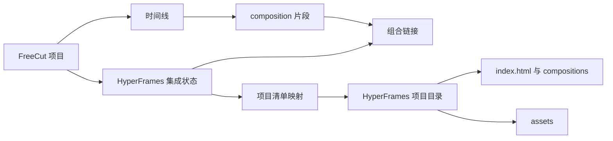

# 数据模型与项目目录

## 本章目标

本章定义 FreeCut 项目如何持久化 HyperFrames 生成能力、项目目录、组合链接、资产、任务历史、渲染缓存和模型来源。它是所有主界面、生成、编辑、预览和导出的共同基础。

## 设计结论

整合后的核心数据设计是“FreeCut 主项目加 HyperFrames 项目目录引用”，而不是把 HTML 字符串塞进时间线项。



## FreeCut 项目扩展

`Project` 增加可选字段 `hyperframes`：

```ts
interface Project {
  hyperframes?: HyperFramesIntegrationState
}
```

该字段必须向后兼容。旧项目没有该字段时，迁移层初始化空集成状态；打开旧项目不应改变原有剪辑语义。

## 时间线项扩展

不新增时间线类型，继续使用现有 `composition`：

```ts
{
  type: 'composition',
  sourceKind: 'hyperframes',
  hyperframesProjectId: 'project-id',
  activeCompositionPath: 'compositions/main.html',
  hyperframesManifestPath: 'hyperframes/project-id/manifest.json'
}
```

这样可以复用 FreeCut 对组合片段的时间线行为，包括移动、修剪、复制、分组、缩放、显示隐藏和导出。`sourceKind` 决定右键菜单、属性面板和双击行为。

## HyperFrames 集成状态

建议的完整状态结构：

```ts
interface HyperFramesIntegrationState {
  schemaVersion: number
  projects: Record<string, HyperFramesProjectManifest>
  compositionLinks: Record<string, HyperFramesCompositionLink>
  renderCache?: Record<string, HyperFramesRenderCacheEntry>
  skills: {
    enabled: string[]
    history: HyperFramesSkillHistoryEntry[]
  }
  modelProfiles?: Record<string, ModelProfile>
  capabilityBindings?: Record<string, ModelCapabilityBinding>
  securityPolicies?: HyperFramesSecurityPolicy
  renderConfig: HyperFramesRenderConfig
}
```

其中当前已经落地的基础字段是 `projects`、`compositionLinks`、`skills` 和 `renderConfig`；模型、能力和安全策略是后续方案要求的扩展。

## HyperFrames 项目目录

一个标准项目目录必须包含：

```text
hyperframes/<项目标识>/
  manifest.json
  index.html
  compositions/
    main.html
    intro.html
    outro.html
  assets/
    image.png
    video.mp4
    music.wav
  thumbnails/
    main.svg
  metadata/
    provenance.json
    diagnostics.json
```

最低可运行目录至少包含：

- `manifest.json`
- `index.html`
- `compositions/main.html`

## 项目清单

清单是 HyperFrames 源目录的权威索引：

```ts
interface HyperFramesProjectManifest {
  id: string
  name: string
  schemaVersion: number
  projectDir: string
  entryFile: string
  activeCompositionPath: string
  width: number
  height: number
  fps: { num: number; den: number }
  durationInFrames: number
  backgroundColor?: string
  assets: HyperFramesAssetRef[]
  compositions: Array<{
    id: string
    path: string
    name: string
    durationInFrames: number
  }>
  source: 'freecut-export' | 'hyperframes-project' | 'legacy-composition' | 'skill-output'
  provenance?: HyperFramesProvenance
  warnings?: string[]
  unsupportedFeatures?: string[]
  createdAt: number
  updatedAt: number
}
```

### 清单字段规则

| 字段 | 规则 |
| --- | --- |
| `id` | 项目内唯一，生成结果建议使用技能任务编号或稳定哈希派生 |
| `projectDir` | 必须是安全相对路径，不允许绝对路径、反斜杠、空路径和越界路径 |
| `entryFile` | 默认 `index.html`，用于播放器和生产器入口 |
| `activeCompositionPath` | 当前在 FreeCut 时间线上引用的组合文件 |
| `fps` | 使用有理数表示，避免浮点误差 |
| `durationInFrames` | FreeCut 时间线以帧为主，清单必须保留帧长度 |
| `source` | 标明来源，方便安全策略和用户理解 |
| `warnings` | 记录降级、丢失和可忽略问题 |
| `unsupportedFeatures` | 记录无法无损映射的特性，必须在界面显示 |

## 组合链接

组合链接把 FreeCut 时间线项和 HyperFrames 项目目录绑定：

```ts
interface HyperFramesCompositionLink {
  timelineItemId: string
  projectId: string
  sourceKind: 'hyperframes'
  activeCompositionPath: string
  manifestPath: string
  thumbnailPath?: string
  renderCacheKey?: string
  includeAudioInProducer?: boolean
}
```

链接必须以时间线项编号为键存入 `compositionLinks`。删除时间线项时必须删除链接；复制时间线项时必须创建新链接，默认引用同一个项目目录，但写入新的 `timelineItemId`。

## 资产模型

资产引用应记录源路径、项目内路径、哈希和媒体属性：

```ts
interface HyperFramesAssetRef {
  id: string
  type: 'video' | 'audio' | 'image'
  sourcePath: string
  projectPath: string
  hash: string
  duration?: number
  width?: number
  height?: number
  hasAudio?: boolean
}
```

### 资产复制策略

1. 外部素材导入生成结果时，复制到 FreeCut 工作区或建立可重连引用。
2. HyperFrames 项目内所有相对引用必须能从 `projectDir` 解析。
3. 资产哈希用于渲染缓存失效。
4. 删除项目目录前必须检查是否仍有时间线项引用。
5. 打包 FreeCut 项目时必须包含被引用的 HyperFrames 项目目录和资产。

## 来源与可追溯性

每次生成、导入、编辑和渲染都要记录来源：

```ts
interface HyperFramesProvenance {
  source: 'freecut-export' | 'skill-output' | 'studio-edit' | 'manual-import'
  prompt?: string
  modelProfileId?: string
  workflowId?: string
  jobId?: string
  inputHash: string
  outputHash: string
  createdAt: number
  confirmedByUser: boolean
}
```

来源记录用于：

- 用户理解结果从哪里来。
- 复现生成。
- 费用和模型审计。
- 支持问题排查。
- 安全事件追踪。
- 项目回滚和缓存失效。

## 存储策略

当前 `HyperFramesProjectStorage` 已支持：

- 浏览器原生私有文件系统。
- 目录句柄适配。
- 内存适配器。
- 保存、加载、删除、列出项目。
- 安全相对路径校验。

后续需要补齐：

1. 二进制资产写入与读取。
2. 缩略图缓存。
3. 波形缓存。
4. 渲染缓存。
5. 清单索引压缩。
6. 项目打包和解包。
7. 存储配额检测与清理策略。

## 迁移策略

### 从旧项目迁移

迁移层必须处理三类项目：

1. 没有 HyperFrames 字段的普通 FreeCut 项目。
2. 曾经内嵌单个组合 HTML 或旧 `compositions` 字段的项目。
3. 已有清单式项目目录的项目。

迁移规则：

- 普通项目初始化空 `hyperframes` 状态。
- 旧内嵌组合迁移为 `source: 'legacy-composition'` 的项目目录。
- 旧时间线组合项增加 `sourceKind`、`hyperframesProjectId` 和 `activeCompositionPath`。
- 保留旧字段只作为一次性兼容读取，不作为新写入格式。

### 清单版本升级

每次清单结构变化都要：

- 增加 `schemaVersion`。
- 写迁移函数。
- 保留读取旧版本能力。
- 提供回滚或降级说明。
- 增加单元测试和夹具。

## 可编辑近似项

导入 HyperFrames 项目目录时，系统可以把受支持节点反向映射成 FreeCut 原生项。这些项是编辑便利层，不是权威源。

受支持范围：

- 文本。
- 视频。
- 音频。
- 图片。
- 基础形状。
- 嵌套组合。
- 受控关键帧数据。

无法无损解析的内容必须保留在项目目录中，并在 `unsupportedFeatures` 中记录，例如复杂脚本、自定义画布、复杂样式、未支持动效和外部运行时。

## 渲染缓存

渲染缓存键必须由以下内容共同决定：

- 项目标识。
- 活动组合路径。
- 所有项目文件哈希。
- 资产哈希。
- 渲染质量。
- 输出格式。
- 分辨率。
- 帧率。
- 是否包含 HyperFrames 音频。
- 生产器版本。

缓存失效条件：

- 任一文件内容变化。
- 任一资产变化。
- 清单版本变化。
- 渲染配置变化。
- 用户手动清理缓存。

## 数据完整性检查

项目保存前必须检查：

1. 所有 `compositionLinks` 指向存在的项目清单。
2. 所有 `activeCompositionPath` 在项目目录文件表中存在。
3. 所有项目目录路径安全。
4. 所有资产引用可解析或有明确缺失诊断。
5. 清单中 `durationInFrames`、`fps` 和时间线项持续时间一致或有解释。
6. 每个 AI 写入都有确认记录。

## 开发落地补充：数据模型与源码镜像的连接

源码级迁移后，数据模型要同时服务 FreeCut 项目、HyperFrames 项目目录和上游镜像源码。建议增加以下工程约束：

### 项目目录仓储接口

`HyperFramesProjectStorage` 继续作为底层存储实现，但对 Studio、Player、Lint、Producer 暴露统一仓储接口：

```text
HyperFramesProjectRepository
  listProjectRefs(freecutProjectId)
  readManifest(projectId)
  writeManifest(projectId, manifest, provenance)
  readFile(projectId, path)
  writeFile(projectId, path, content, provenance)
  copyAsset(projectId, sourceAsset, targetPath)
  createSnapshot(projectId, reason)
  restoreSnapshot(projectId, snapshotId)
  computeSignature(projectId)
```

这个接口由 `adapters/freecut-project` 实现，上游迁移源码不能绕过它直接访问 OPFS、FileSystemHandle 或 Node fs。

### 清单补充字段

为了支持源码迁移、Studio 保存、模型生成和渲染缓存，manifest 建议扩展以下字段：

| 字段 | 说明 |
| --- | --- |
| `sourceRuntimeVersion` | 当前 FreeCut 内置 HyperFrames 运行时版本 |
| `upstreamSource` | 源码来自 HyperFrames 哪个本地快照、包和路径 |
| `adapterVersion` | FreeCut 适配层版本，用于迁移兼容 |
| `lastStudioSave` | 工作室保存时间、用户、文件列表和快照 |
| `lastModelMutation` | 最近一次模型写入的模型配置、prompt 摘要和确认记录 |
| `lintSummary` | 最近一次 lint 阻塞项、警告项和通过时间 |
| `previewSignature` | Player 预览使用的项目签名 |
| `renderSignature` | Producer 渲染缓存使用的项目签名 |

这些字段不应保存密钥、完整 prompt 中的隐私素材或模型原始响应。需要追溯时使用本地审计日志引用。

### 路径规范

项目目录内路径必须统一为 POSIX 相对路径：

- 允许：`index.html`、`compositions/main.html`、`assets/logo.png`、`scripts/local.js`。
- 禁止：绝对路径、`..`、Windows 盘符、URL 形式的本地文件路径。
- 对远程 URL 素材，manifest 记录原始 URL，同时导入时尽量复制到 `assets/remote/` 并记录 hash。
- 对模型生成的临时文件，先进入 `generated/`，确认导入后再移动到正式目录。

### 源码来源记录

新增 `provenance/upstream-manifest.json` 用于记录迁移的 HyperFrames 源码来源，不放在用户项目目录，而放在 FreeCut 运行时目录。建议结构：

```json
{
  "hyperframesRoot": "/Users/changzechuan/VideoAIEditProjects/hyperframes",
  "snapshotAt": "2026-07-17",
  "packages": {
    "player": {
      "source": "packages/player/src",
      "target": "src/features/hyperframes-runtime/upstream/player",
      "importRewrite": true
    }
  }
}
```

这样可以在升级 HyperFrames 源码时做差异审计，而不是把上游代码改到不可追踪。

### 迁移测试

数据模型层新增测试：

1. 旧 `hyperframes.compositions` 迁移到 manifest 项目目录。
2. 源链接 `composition` 项缺少 manifest 时给出阻塞诊断。
3. Studio 保存后 `previewSignature` 改变，时间线项 id 不变。
4. 模型写入后生成 provenance，undo 能恢复文件内容和 manifest。
5. Producer 渲染缓存命中时校验 `renderSignature`、runtime version 和输出格式。
6. 源码镜像版本升级时，旧项目可通过 adapter migration 打开。
