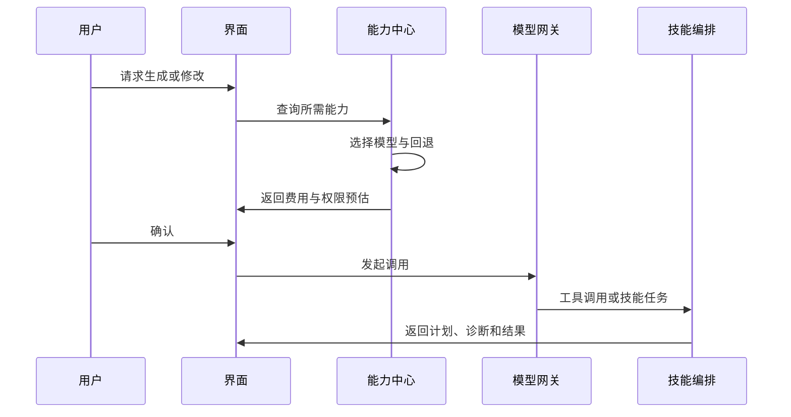

# 模型配置与能力中心

## 本章目标

本章定义 FreeCut 主界面内的模型配置中心。目标是让用户可以自由接入任意大模型、私有模型网关和本地模型，并把这些模型能力安全地提供给 HyperFrames 生成、编辑、诊断和渲染辅助流程。

## 设计原则

1. 面向能力配置，而不是面向某个固定供应商配置。
2. 模型选择必须能按项目、用户、团队和任务类型覆盖。
3. 密钥和凭据不能进入 FreeCut 项目文件。
4. 每次调用都要记录模型、能力、输入输出规模、费用估算和任务来源。
5. 不同模型能力不足时必须给出可理解的降级方案。

## 能力分类

模型中心不直接要求用户理解每个模型的全部细节，而是把模型声明为能力集合：

| 能力 | 用途 |
| --- | --- |
| 文本规划 | 生成脚本、分镜、任务计划、工作流参数 |
| 代码生成 | 生成或修改 HyperFrames HTML、样式和脚本 |
| 视觉理解 | 理解素材画面、截图、网页视觉、生成结果预览 |
| 语音转文字 | 生成字幕、剪辑口播、音乐对齐 |
| 语音合成 | 生成旁白、角色语音、占位配音 |
| 图像生成 | 生成背景、插画、分镜图、贴图 |
| 音乐生成 | 生成背景音乐、循环、节奏素材 |
| 音效生成 | 生成提示音、转场音、环境声 |
| 嵌入检索 | 搜索素材、历史项目、模板和知识库 |
| 网页理解 | 抓取网站、理解产品页面、提取品牌元素 |
| 工具调用 | 允许模型调用技能、文件、渲染、校验和搜索工具 |

## 模型配置对象

建议新增配置模型：

```ts
interface ModelProfile {
  id: string
  name: string
  providerType: 'cloud' | 'local' | 'gateway' | 'freecut-built-in'
  endpoint?: string
  authRef?: string
  defaultModel: string
  models: Array<{
    id: string
    displayName: string
    contextWindow?: number
    inputModalities: Array<'text' | 'image' | 'audio' | 'video' | 'file'>
    outputModalities: Array<'text' | 'image' | 'audio' | 'video' | 'json'>
    capabilities: string[]
    cost?: {
      inputToken?: number
      outputToken?: number
      image?: number
      audioMinute?: number
      videoSecond?: number
    }
    latencyClass: 'fast' | 'balanced' | 'slow'
    privacyClass: 'local' | 'private' | 'external'
  }>
  rateLimit?: {
    requestsPerMinute?: number
    tokensPerMinute?: number
    dailyBudget?: number
  }
  enabled: boolean
}
```

## 能力绑定

项目或用户需要把能力绑定到具体模型：

```ts
interface ModelCapabilityBinding {
  capability: string
  profileId: string
  modelId: string
  fallback?: Array<{ profileId: string; modelId: string }>
  quality: 'draft' | 'standard' | 'high'
  maxCostPerTask?: number
  requiresConfirmationAboveCost?: number
}
```

示例：

- 草稿脚本：低成本快速文本模型。
- 终稿代码生成：高质量代码模型。
- 视觉理解：多模态模型。
- 私密素材分析：本地模型。
- 语音转文字：FreeCut 现有本地转写。
- 语音合成：FreeCut 现有语音合成或外部语音模型。

## 供应商适配

### 云端供应商

需要支持：

- 基础地址。
- 模型列表。
- 鉴权方式。
- 自定义请求头。
- 代理。
- 超时。
- 重试。
- 限流。
- 费用。

不应在代码里写死供应商。所有云端供应商通过统一请求适配器接入。

### 私有网关

企业用户可能使用自己的模型网关。网关配置需要支持：

- 与常见聊天接口兼容的路径。
- 自定义能力声明。
- 组织级密钥。
- 审计标识。
- 网络代理。
- 内网证书。

### 本地模型

本地模型配置需要支持：

- 本地服务地址。
- 模型文件路径。
- 运行状态检查。
- 显存或内存要求。
- 最大上下文。
- 支持的输入输出类型。
- 是否允许离线使用。

FreeCut 已有的本地转写、字幕、嵌入、语音和音乐能力应注册为内置模型配置，而不是特殊分支。

## 凭据管理

凭据不进入项目文件。建议使用三层引用：

1. 用户本机安全存储。
2. 团队远程密钥服务。
3. 临时会话令牌。

项目文件中只保存：

- `authRef`。
- 供应商编号。
- 使用策略。
- 调用记录摘要。

不得保存：

- 原始密钥。
- 长期令牌。
- 完整用户隐私输入。
- 未脱敏模型响应日志。

## 权限与工具能力

每个模型绑定必须声明允许的工具：

| 工具权限 | 说明 |
| --- | --- |
| 读取项目上下文 | 可读取时间线、素材名、选区、清单、诊断 |
| 读取源文件 | 可读取 HyperFrames 项目 HTML、样式和清单 |
| 修改源文件 | 可提出文件修改，但必须确认后写入 |
| 修改时间线 | 可提出时间线操作，但必须确认后写入 |
| 运行技能 | 可创建技能任务 |
| 访问网络 | 可抓取网页、下载素材或调用外部服务 |
| 访问本地文件 | 可读取用户授权文件或项目资源 |
| 运行渲染 | 可创建渲染任务 |
| 访问缓存 | 可读取或写入生成缓存 |

默认策略应保守：

- 允许读取当前项目摘要。
- 禁止直接写项目。
- 禁止未经确认访问网络。
- 禁止未经确认产生费用超过阈值的调用。

## 模型配置界面

模型与能力中心分为五个页签：

### 供应商

- 添加供应商。
- 测试连接。
- 拉取或手动填写模型列表。
- 配置代理和超时。
- 查看健康状态。

### 能力映射

- 按能力选择默认模型。
- 设置草稿、标准、高质量三档。
- 设置回退顺序。
- 设置最大费用。

### 凭据

- 添加密钥。
- 检查密钥有效性。
- 设置密钥作用域。
- 撤销密钥。
- 查看最近使用记录。

### 成本与配额

- 项目预算。
- 每日预算。
- 单任务预算。
- 超额确认阈值。
- 调用明细。
- 失败重试成本。

### 隐私与权限

- 是否允许发送素材内容。
- 是否允许发送截图。
- 是否允许发送源代码。
- 是否允许网络抓取。
- 是否允许远程渲染。
- 是否对日志脱敏。

## 任务调用流程



## 成本控制

必须实现：

- 每次任务开始前的费用预估。
- 运行中的费用累计。
- 超预算暂停。
- 失败重试是否计费的提示。
- 低成本草稿模式。
- 高质量终稿模式。
- 项目级成本报表。

## 模型失败与降级

| 失败 | 降级策略 |
| --- | --- |
| 主模型超时 | 切换回退模型 |
| 视觉能力缺失 | 改用文本描述或请求用户上传截图 |
| 上下文过长 | 分段摘要和检索 |
| 费用超限 | 切换草稿模型或请求确认 |
| 本地模型未启动 | 启动引导或切换云端 |
| 网络不可用 | 使用本地模板和缓存 |

## 与 HyperFrames 技能的关系

HyperFrames 技能不等同于模型。技能是工作流知识，模型是执行这些工作流的推理与生成引擎。FreeCut 必须把两者分开管理：

- 技能决定“怎么做”。
- 模型决定“由谁来生成、理解和修改”。
- 工具权限决定“能访问什么”。
- 项目目录保存“做出的结果”。

## 开发落地补充：模型网关源码结构

模型能力中心不应和 HyperFrames 上游源码耦合。它属于 FreeCut 适配层，为迁移后的技能、Studio 助手和自然语言编辑提供统一模型访问。

建议新增：

```text
src/features/hyperframes-integration/models/
  model-profile.ts
  model-capabilities.ts
  model-registry.ts
  credential-store.ts
  cost-estimator.ts
  providers/
    openai-compatible.ts
    private-gateway.ts
    local-http.ts
    local-command.ts
    freecut-builtins.ts
  permissions/
    tool-permissions.ts
    material-scope.ts
    network-policy.ts
```

核心接口：

```text
ModelProviderAdapter
  id
  displayName
  capabilities
  validateConnection(profile)
  estimate(request)
  invokeText(request)
  invokeVision(request)
  invokeAudio(request)
  invokeToolPlan(request)
```

模型调用不能直接写项目。调用结果必须进入以下任一对象：

- `GenerationPlan`
- `StudioFilePatchProposal`
- `TimelineActionProposal`
- `DiagnosticsRepairProposal`
- `SkillExecutionInput`

然后由用户确认，再由对应 adapter 写入。

### 任意模型配置细节

任意模型并不表示任意代码执行。每个模型配置必须声明：

| 配置项 | 说明 |
| --- | --- |
| `baseUrl` | OpenAI-compatible、私有网关或本地 HTTP 入口 |
| `apiKeyRef` | 凭据引用，不保存明文 |
| `modelId` | 供应商内部模型名 |
| `capabilities` | 文本、视觉、音频、代码、结构化输出、工具调用 |
| `contextLimits` | 输入、输出、文件、图片、音频限制 |
| `pricing` | 费用估算，未知时显示无法估算 |
| `privacyMode` | 云端、本地、私有网关、禁止上传素材 |
| `toolPolicy` | 可访问的工具和素材范围 |
| `timeoutPolicy` | 超时、重试和降级模型 |

### 与技能系统的连接

迁移后的 `skills/*` 不应直接知道具体模型供应商。技能只声明能力需求：

```text
needs:
  text.reasoning: high
  vision.image-understanding: optional
  code.html-css-js: required
  audio.transcription: optional
  render.preview: required
```

模型能力中心根据需求选择模型组合：

1. 文案和脚本模型。
2. 视觉分析模型。
3. 代码生成模型。
4. 本地转写或云端转写模型。
5. 质量检查模型。

### 安全写入约束

模型响应必须经过四层处理：

1. 结构化解析：只接受 JSON schema 或明确 patch 格式。
2. 路径校验：只允许写入当前 HyperFrames 项目目录内安全路径。
3. 内容校验：HTML、CSS、JS、资产引用和网络访问规则检查。
4. 用户确认：显示 diff、预览、成本和可回滚点。

### 测试要求

模型中心需要模拟 provider 测试：

- 连接失败、超时、401、限流和费用超限。
- 本地模型未启动时的 UI 状态。
- 视觉能力缺失时技能降级。
- 私有网关不支持工具调用时的计划改写。
- 模型生成非法文件路径时被拒绝。
- 模型输出无法解析时可重试，不污染项目目录。
