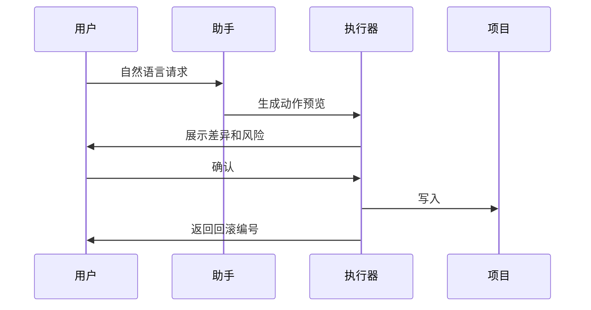

# 工作室编辑与自然语言协作

## 本章目标

本章定义 HyperFrames 工作室如何嵌入 FreeCut 主界面，以及自然语言助手如何安全地修改时间线和 HyperFrames 项目文件。它重点解决“生成后还能不能精修”和“模型能不能安全改项目”的问题。

## 工作室定位

工作室是源链接组合片段的编辑界面。它不是独立应用，而是 FreeCut 中的一个上下文浮层：

- 输入是当前 FreeCut 项目中的 HyperFrames 项目目录。
- 输出仍写回该项目目录。
- 关闭后回到原时间线位置。
- 所有保存都触发清单签名更新、诊断刷新和缓存失效。

## 工作室最小能力

第一版必须具备：

- 文件树。
- 当前文件源码编辑。
- iframe 预览。
- 保存。
- 关闭。
- 未保存提示。
- 诊断列表。

当前 `HyperFramesStudioPanel` 已具备文件树、源码编辑、预览和保存样机，可作为最小版本。

## 工作室完整能力

最终版应接入从 `packages/studio/src` 源码迁移后的工作室能力：

- 播放器。
- 播放控制。
- 时间线视图。
- 源码编辑器。
- 属性面板。
- 元素选择。
- 文件树。
- 组合层级面包屑。
- 活动轨道。
- 热更新。
- 变量编辑。
- 诊断面板。

## 工作室适配器

工作室不能直接读写 FreeCut 内部状态。它通过适配器访问项目：

```ts
interface StudioApiAdapter {
  listProjects(): Promise<ProjectSummary[]>
  resolveProject(projectId: string): Promise<ProjectDirectory>
  readFile(projectId: string, path: string): Promise<string>
  writeFile(projectId: string, path: string, contents: string): Promise<{ hash: string }>
  createFile(projectId: string, path: string, contents: string): Promise<{ hash: string }>
  deleteFile(projectId: string, path: string): Promise<void>
  patchFile(projectId: string, path: string, patches: Patch[]): Promise<{ hash: string }>
  lint(projectId: string, html?: string): Promise<Diagnostic[]>
  thumbnail(projectId: string, activeCompositionPath: string): Promise<Thumbnail>
  waveform(projectId: string, assetId: string): Promise<Waveform>
  startRender(projectId: string, options?: RenderOptions): Promise<RenderJob>
}
```

当前 `studio-adapter.ts` 已提供这些接口的样机。后续应替换为连接真实存储、真实校验器和真实生产器的实现。

## 文件编辑规则

1. 所有路径必须经过安全相对路径校验。
2. `manifest.json` 修改必须通过结构化表单或专用 API，避免用户误改破坏项目。
3. `index.html` 和组合文件允许源码编辑，但保存前必须校验。
4. 新增文件必须更新文件索引。
5. 删除文件前必须检查是否被 `data-composition-src`、资产清单或活动组合引用。
6. 保存后必须更新项目签名。

## 变量编辑

HyperFrames 支持组合变量。FreeCut 工作室应把变量显示为表单：

- 标题文本。
- 品牌色。
- 图片或视频引用。
- 数字参数。
- 布尔开关。
- 选项。

变量编辑的优先级：

1. 用户改当前时间线片段的实例变量。
2. 如果变量是组合默认值，则写回组合文件。
3. 如果变量来自模型生成参数，则同步更新来源记录。

## 自然语言助手能力

助手分四类意图：

| 意图 | 例子 |
| --- | --- |
| 聊天解释 | “这个片段为什么有警告？” |
| 时间线动作 | “把选中片段右移 20 帧” |
| 工作室文件修改 | “把标题颜色改成品牌蓝” |
| 技能任务 | “生成一个 5 秒透明片尾动画” |

当前 `assistant-core.ts` 已定义这些意图类别，可继续扩展中文解析、多轮上下文和模型函数调用。

## 安全写入流程

助手的写入流程固定为：



模型响应不能直接进入项目写入函数。

## 差异预览

差异预览必须能被用户理解：

- 时间线差异显示片段名称、轨道、起止帧、修改前后值。
- 文件差异显示文件路径、修改片段和风险。
- 技能导入差异显示新增项目目录、时间线项和资产。
- 渲染差异显示缓存替换和输出路径。

## 回滚

回滚要覆盖：

- 时间线状态。
- HyperFrames 文件快照。
- 项目清单。
- 组合链接。
- 资产引用。
- 渲染缓存。
- 任务导入状态。

每次确认写入后，助手面板要显示“撤回本次操作”。

## 预览与保存策略

工作室中存在三层状态：

1. 临时编辑态：用户正在输入，尚未保存。
2. 工作室保存态：写回 HyperFrames 项目目录，但尚未改变 FreeCut 时间线结构。
3. 项目提交态：FreeCut 项目保存并可恢复。

保存工作室文件会导致：

- 项目目录文件变化。
- 文件哈希变化。
- 清单更新时间变化。
- 缩略图过期。
- 渲染缓存过期。
- 诊断重新运行。

## 与主时间线同步

工作室打开时需要锁定或提示以下情况：

- 时间线片段被删除。
- 源项目被另一个面板修改。
- 渲染任务正在使用该项目目录。
- 当前文件被模型任务修改。

推荐策略是乐观并发：

- 保存时检查项目签名。
- 如果签名变化，展示冲突比较。
- 用户可选择覆盖、合并或另存为新项目。

## 元素选择

完整工作室应支持从预览中点击元素，联动：

- 源码定位。
- 属性面板。
- 时间线条。
- AI 助手上下文。

元素身份应优先使用 HyperFrames 的稳定标识能力，例如确定性元素编号。缺失时，保存前应自动补齐可编辑标识。

## 诊断修复

诊断面板提供三类修复：

- 自动修复：如补充缺失 `class="clip"`、补齐尺寸、修复安全路径。
- 半自动修复：模型根据诊断提出文件补丁，用户确认。
- 手动修复：定位到源码或属性表单。

修复后必须重新校验。

## 协作边界

第一版按单用户本地编辑设计。团队协作需要额外能力：

- 远程项目目录版本。
- 文件锁或冲突合并。
- 任务归属。
- 审批记录。
- 评论和标注。

这些能力不应阻塞单用户集成，但数据模型要保留来源和版本字段。

## 开发落地补充：Studio 源码迁移细则

`packages/studio` 是主面板深度集成的核心来源，但迁移时不能直接把上游 `StudioApp` 当成独立应用挂载。应把它拆成 FreeCut 可控的工作室组件层。

### 第一批迁移文件

建议先迁移这些上游文件：

| 能力 | 上游路径 | FreeCut 目标 |
| --- | --- | --- |
| Studio 总入口参考 | `packages/studio/src/App.tsx` | `upstream/studio/App.tsx`，作为拆分参考，不直接接管路由 |
| NLE 布局 | `packages/studio/src/components/nle/NLELayout.tsx` | `upstream/studio/components/nle/NLELayout.tsx` |
| NLE 预览 | `packages/studio/src/components/nle/NLEPreview.tsx` | `upstream/studio/components/nle/NLEPreview.tsx` |
| 组合面包屑 | `components/nle/CompositionBreadcrumb.tsx` | 工作室顶部路径导航 |
| 播放控制 | `packages/studio/src/player/*` | `upstream/studio/player` |
| 文件树 | `components/editor/FileTree.tsx` | 工作室左侧文件面板 |
| 源码编辑 | `components/editor/SourceEditor.tsx` | 工作室源码 tab |
| 属性面板 | `components/editor/PropertyPanel.tsx` 和子模块 | 工作室右侧 DOM 属性面板 |
| source patch | `utils/sourcePatcher.ts` | 写回项目目录的 patch 工具 |
| HTML 编辑工具 | `utils/htmlEditor.ts` | DOM 属性和标签更新 |
| 元素选择 | `hooks/useElementPicker.ts` | 预览点击选择 |

### 第二批迁移文件

当第一批稳定后，再迁移：

- `components/editor/DomEditOverlay.tsx`
- `components/editor/LayersPanel.tsx`
- `components/editor/manualEdits*.ts`
- `components/editor/studioMotion*.ts`
- `components/editor/motionPath*.ts`
- `components/editor/snap*.ts`
- `components/sidebar/AssetsTab.tsx`
- `components/sidebar/BlocksTab.tsx`
- `components/renders/RenderQueue.tsx`
- `components/storyboard/*`
- `captions/*`

这些模块依赖更深，需要先建立文件服务、选择服务、渲染服务和素材服务。

### FreeCut 工作室外壳

新增：

```text
src/features/hyperframes-runtime/bridges/studio-bridge/
  FreeCutStudioShell.tsx
  FreeCutStudioToolbar.tsx
  FreeCutStudioPanels.tsx
  useFreeCutStudioSession.ts
  createFreeCutStudioAdapter.ts
  studioSaveQueue.ts
  studioUndoBridge.ts
  studioThemeAdapter.ts
```

`FreeCutStudioShell` 负责：

1. 从时间线 `composition` 项解析 `hyperframesProjectId`。
2. 加载 manifest、当前组合、文件树、诊断和缩略图。
3. 向迁移后的 Studio 组件注入 adapter。
4. 管理保存队列、dirty 状态、关闭确认和 undo。
5. 把 Studio 选择结果同步到 FreeCut 属性面板。

### Studio adapter

上游 Studio 需要的文件、预览和选择能力都通过 adapter 获得：

```text
FreeCutStudioAdapter
  listFiles(projectId)
  readFile(projectId, path)
  writeFile(projectId, path, content, patchMeta)
  previewUrl(projectId, compositionPath)
  lint(projectId, compositionPath)
  getSelection(projectId)
  updateSelection(projectId, selection)
  generateThumbnail(projectId, options)
  renderPreview(projectId, options)
```

这个 adapter 内部调用现有 `server/studio-adapter.ts` 能力，并逐步替换为迁移后的 `studio-server` helpers。

### 样式和主题

`packages/studio` 有自己的 UI 组件和 Tailwind preset。FreeCut 迁移时应避免引入第二套全局样式污染：

- 优先把 Studio 样式包在 `.freecut-hyperframes-studio` 根类下。
- 上游 Tailwind token 映射到 FreeCut CSS variables。
- 图标统一替换为 FreeCut 已使用的图标库或迁移为局部组件。
- 不允许上游全局 reset 覆盖 FreeCut 主界面。

### 自然语言写入工作室

自然语言助手修改 Studio 文件时不能直接调用 `writeFile`。流程必须是：

1. 读取当前 selection、source file、DOM snapshot 和 manifest。
2. 模型产生 `StudioFilePatchProposal`。
3. 使用迁移后的 `sourcePatcher.ts` 或 `sourceMutation.ts` 生成可应用 patch。
4. 运行 parsers/lint。
5. 展示 diff 和预览。
6. 用户确认后写入仓储。
7. 生成 undo journal。

### Studio 测试

迁移后至少建立以下测试：

- 工作室打开指定 HyperFrames 片段，读取正确项目目录。
- 文件树点击后源码编辑器显示内容。
- 修改源码保存后 manifest signature 更新。
- 属性面板修改颜色、位置、文字后生成 patch。
- 预览选择元素后右侧属性面板同步。
- 关闭有未保存修改的工作室会阻止关闭或要求确认。
- 自然语言修改生成 diff，确认前不写入文件。
