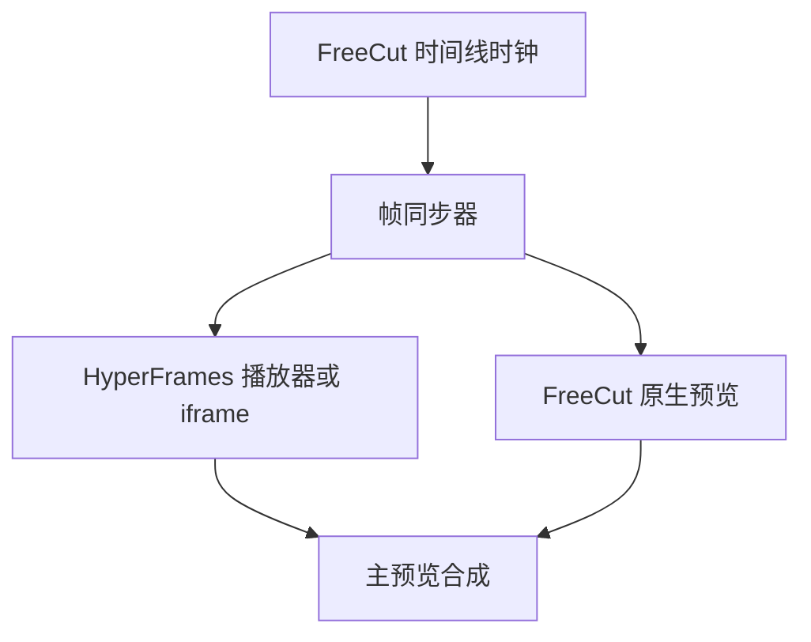
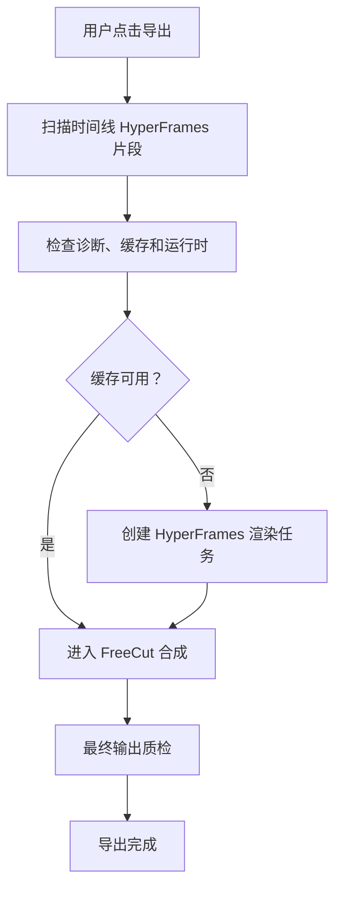

# 预览渲染与导出管线

## 本章目标

本章定义 HyperFrames 内容在 FreeCut 中如何预览、缓存、渲染和参与最终导出。核心目标是保证主界面体验顺滑，同时最终视频帧准确、音频正确、透明叠加可用。

## 渲染模式

系统支持三种渲染模式：

| 模式 | 用途 | 引擎 |
| --- | --- | --- |
| FreeCut 原生模式 | 普通时间线项目，无 HyperFrames 片段 | FreeCut 预览与导出 |
| HyperFrames 预渲染模式 | 先把 HyperFrames 片段渲染成媒体，再由 FreeCut 合成 | HyperFrames 生产器加 FreeCut 导出 |
| 混合叠加模式 | HyperFrames 输出透明叠加，覆盖在 FreeCut 主视频上 | HyperFrames 生产器加透明合成 |

默认策略：

- 编辑时优先实时预览。
- 复杂片段自动提示预渲染。
- 最终导出前检查缓存和签名。
- 透明动画优先使用透明叠加。

## 预览架构



## 播放器接入

HyperFrames 播放器提供：

- 隔离 iframe。
- 播放、暂停、跳转。
- 当前时间。
- 总时长。
- 就绪事件。
- 错误事件。

FreeCut 需要封装一个 `HyperFramesPreviewHost`：

```ts
interface HyperFramesPreviewHost {
  load(projectId: string, activeCompositionPath: string): Promise<void>
  seek(timeSeconds: number): Promise<void>
  play(): Promise<void>
  pause(): Promise<void>
  captureFrame?(frame: number): Promise<ImageBitmap>
  dispose(): void
}
```

第一版可用 iframe `srcDoc` 预览；完整版本应接入从 `packages/player/src` 和 `packages/studio/src/player` 源码迁移后的播放器桥。

## 帧同步

FreeCut 时间线以帧为单位，HyperFrames 组合以秒和帧率共同表示。同步规则：

```text
项目当前秒 = 当前帧 / FreeCut 项目帧率
片段内秒 = (当前帧 - 片段起始帧 + 源偏移帧) / 片段帧率
```

门禁：

- 预览帧和生产器渲染帧最大误差不超过 1 帧。
- 导出帧和预览帧最大误差不超过 1 帧。
- 不同帧率时必须使用有理数帧率转换。

## 生产器运行时

完整渲染需要检查：

- Node.js。
- Chrome 或 Chromium。
- FFmpeg。
- 从 `packages/producer/src` 迁移后的 producer-node 构建。
- 字体。
- GPU 编码能力。
- Docker 能力，若启用确定性渲染。

当前 `checkRenderRuntime` 已能抽象运行时可用性。主界面应把缺失项转成可操作提示。

## 渲染任务

渲染任务状态：

- 排队。
- 渲染中。
- 完成。
- 失败。
- 取消。

任务输入：

- 项目标识。
- 组合路径。
- 帧率。
- 质量。
- 格式。
- 输出分辨率。
- 项目签名。

输出：

- 输出路径。
- 渲染日志。
- 当前帧。
- 进度。
- 失败原因。
- 清理要求。

## 输出格式

| 格式 | 用途 |
| --- | --- |
| 普通视频 | 完整 HyperFrames 片段作为独立媒体 |
| 透明视频 | 动态图形、字幕包装、片头片尾叠加 |
| 图片序列 | 调试、逐帧质检、复杂合成 |
| 音频混合输出 | HyperFrames 自带音乐或音效需要保留时 |

透明叠加优先使用支持透明通道的格式；最终与 FreeCut 导出合成时再编码到目标格式。

## 音频策略

HyperFrames 内容可能包含音频。每个源链接组合需要设置：

- 使用 FreeCut 音频。
- 使用 HyperFrames 音频。
- 混合两者。
- 静音 HyperFrames。

默认策略：

- 动态图形和字幕包装：不使用 HyperFrames 音频。
- 产品视频和解释视频：保留 HyperFrames 音频，但在 FreeCut 中显示可控音频轨或音频属性。
- 音乐视频：以 HyperFrames 音频为主，但允许拆成 FreeCut 音频轨。

## 透明叠加计划

透明叠加合成步骤：

1. FreeCut 导出基础视频或产生基础帧流。
2. HyperFrames 生产器输出透明视频或图片序列。
3. 使用 FFmpeg 叠加。
4. 根据设置选择 FreeCut 音频或 HyperFrames 音频。
5. 输出最终文件。

当前 `buildAlphaOverlayPlan` 已描述 FFmpeg 叠加命令，可扩展为真实导出步骤。

## 缓存策略

缓存分层：

- 缩略图缓存。
- 预览缓存。
- 渲染缓存。
- 音频波形缓存。
- 诊断缓存。

缓存键必须包含：

- 项目目录签名。
- 活动组合路径。
- 输出分辨率。
- 帧率。
- 质量。
- 格式。
- 是否透明。
- 是否包含音频。
- 生产器版本。

签名变化时必须自动失效。

## 导出流程



导出前必须提示：

- 有阻塞诊断。
- 有未保存工作室修改。
- 有过期缓存。
- 渲染运行时缺失。
- 预计渲染时间和费用。

## 质量门禁

导出阻塞条件：

- 活动组合文件缺失。
- 项目目录清单缺失。
- 安全校验失败。
- 生产器运行时不可用且没有缓存。
- 渲染任务失败。
- 透明叠加失败。

非阻塞警告：

- 有不可反向映射特性。
- 预览可能卡顿。
- 缓存来自旧质量档位。
- 音频来源可能重复。

## 性能目标

发布目标建议：

- 应用启动小于 2 秒。
- 项目加载小于 2 秒。
- 普通编辑响应小于 100 毫秒。
- 预览播放至少 30 帧每秒。
- 典型项目内存小于 1 吉字节。
- 简单转换小于 1 秒。
- 复杂转换小于 5 秒。

这些目标应区分编辑体验和生产渲染。生产渲染可以慢，但必须可取消、可后台运行、可恢复、可诊断。

## 开发落地补充：Player 与 Producer 源码接入

### Player 源码迁移

`packages/player/src` 需要迁移为浏览器安全代码。重点文件：

| 能力 | 上游路径 |
| --- | --- |
| Web Component | `packages/player/src/hyperframes-player.ts` |
| iframe 创建和缩放 | `packages/player/src/iframe-dom.ts` |
| 播放控制 | `controls.ts`、`controls-setup.ts` |
| 运行时消息 | `runtime-message-handler.ts` |
| 直接时间线时钟 | `direct-timeline-clock.ts` |
| 父级媒体代理 | `parent-media.ts` |
| 组合探测 | `composition-probe.ts` |
| shader 加载 | `shader-options.ts`、`shader-loader-state.ts`、`shader-loader-element.ts` |
| 媒体观察 | `mediaObserverScope.ts`、`media-element-guards.ts` |

FreeCut 不直接在业务组件里使用 `<hyperframes-player>`，而是封装：

```text
HyperFramesPlayerHost
  props:
    projectId
    compositionPath
    currentFrame
    fps
    playbackState
    sandboxPolicy
  events:
    onReady
    onFrame
    onDuration
    onSelection
    onError
```

桥接要处理：

- FreeCut frame 到 HyperFrames currentTime 的转换。
- 播放器内部 duration 到 FreeCut 片段 duration 的校验。
- muted、volume、playbackRate 与 FreeCut 音频状态同步。
- iframe sandbox 和 CSP。
- `resolveIframe` 问题：如果使用 Web Component，必须从 shadow DOM 取内部 iframe，不能把 host 当 iframe。
- 错误事件转为 FreeCut 可展示诊断。

### Producer 源码迁移

`packages/producer/src` 是 Node 能力，不能进入浏览器 bundle。建议迁移到：

```text
src/features/hyperframes-runtime/upstream/producer-node/
```

并由本地服务调用。重点文件：

| 能力 | 上游路径 |
| --- | --- |
| 渲染服务入口 | `packages/producer/src/server.ts`、`index.ts` |
| 浏览器管理 | `services/browserManager.ts` |
| HTML 编译 | `services/htmlCompiler.ts`、`compilationRunner.ts` |
| 帧捕获 | `services/frameCapture.ts` |
| 音频提取和混音 | `services/audioExtractor.ts`、`audioMixer.ts` |
| 编码 | `services/chunkEncoder.ts` |
| 透明和 HDR | `services/hdrCompositor.ts`、`render/hdrMode.ts` |
| 文件服务 | `services/fileServer.ts` |
| 分布式渲染 | `services/distributed/*` |
| 运行时快照 | `services/render/runtimeEnvSnapshot.ts` |
| 观测 | `services/render/observability.ts`、`perfSummary.ts` |

FreeCut 渲染桥不暴露 Producer 内部对象，只暴露：

```text
HyperFramesRenderService
  checkRuntime()
  estimate(job)
  start(job)
  cancel(jobId)
  subscribe(jobId)
  getOutput(jobId)
  clearCache(projectId)
```

### 导出管线集成

FreeCut 最终导出时执行：

1. 扫描时间线中的 HyperFrames 源链接组合。
2. 对每个组合读取 manifest 和 render signature。
3. 如果缓存有效，复用输出文件。
4. 如果缓存无效，调用 `HyperFramesRenderService.start`。
5. 透明片段输出 WebM、PNG 序列或支持 alpha 的中间格式。
6. FreeCut 导出器把 HyperFrames 输出作为叠加层或普通媒体合成。
7. 写入导出报告：每个 HyperFrames 项目的源码签名、运行时版本、渲染参数和诊断。

### 预览与渲染一致性

需要新增一致性测试：

- Player 第 0 帧、尾帧和中间帧与 Producer 抽帧误差不超过 1 帧。
- 透明背景在预览和导出中 alpha 表现一致。
- 音频 offset、volume、loop、trim 在预览和导出中一致。
- 字体和远程资产在生产渲染时可解析或明确失败。
- Producer runtime 缺失时，导出门禁阻止最终导出但不破坏项目。
